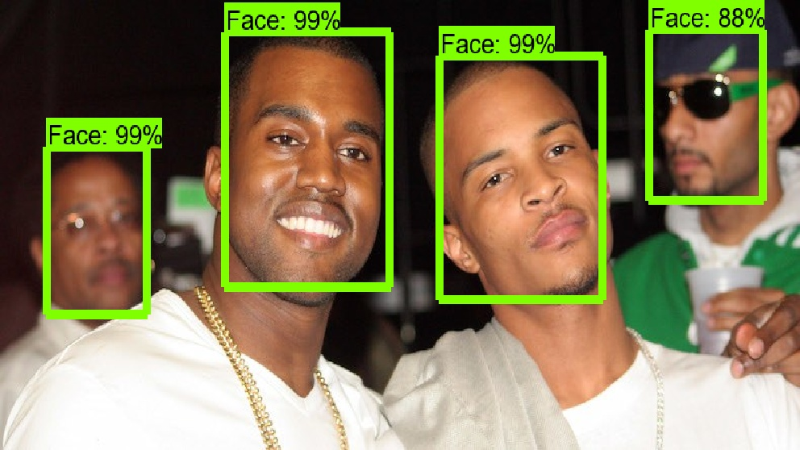
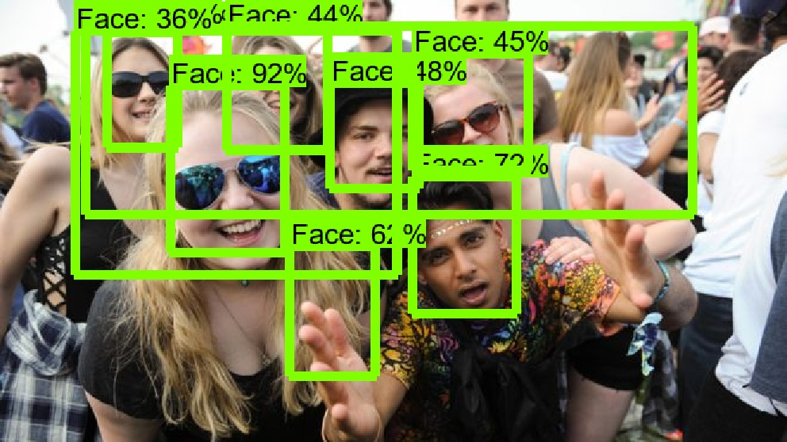

## JIBI: Machine Learning: Reconocimiento de Imágenes (Semana i)

Repositorio para subir las evidencias del taller de Machine Learning para reconocimiento de imágenes por medio de TensorFlow.

**Colaboradores**
* Jesús Mejía > [JesusAlfMejia](https://github.com/JesusAlfMejia/)
* Iván Muñiz > [ivanmuniz](https://github.com/ivanmuniz/)
* Bernardo Gutiérrez > [BernardGU](https://github.com/BernardGU/)
* Iván Contrerras > [xaaniyaro](https://github.com/xaaniyaro/)

### Evidencias por sesión

#### Sesión 28/10/2019
* [ejercicios.py](ejercicios.py)
Ejercicios para aprender a usar numpy
* [uber_display.py](uber_display.py)
Scripts para ejercicios.py
* [PandasExcercises.ipynb](PandasExcercises.ipynb)
Ejercicios para aprender a usar pandas

#### Sesión 29/10/2019
* [DataSetCleaning.ipynb](DataSetCleaning.ipynb)
Ejercicios para aprender a limpiar y transformar un DataSet de imágenes y sus etiquetas

#### Sesión 30/10/2019
* [faster_rcnn_resnet101_coco.config](faster_rcnn_resnet101_coco.config)
Último archivo de configuración probado para el entrenamiento

#### Sesión 31/10/2019
* [output/images](output/images)
Imágenes que se corrieron por la red para el reconocimiento de caras

#### Sesión 01/11/2019
* Equipo 9 score: 11.02%

##### We had some pretty good results in some images:
.
##### But we also had some weird results:
.
